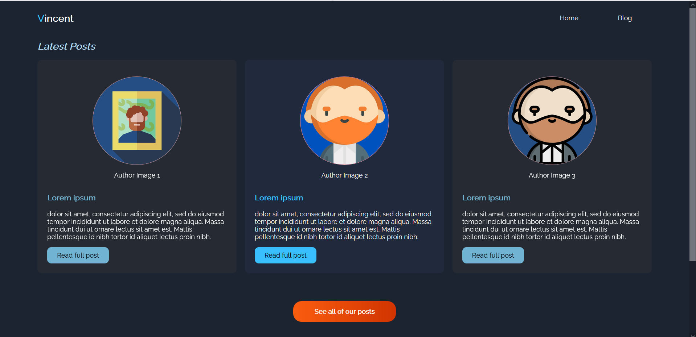
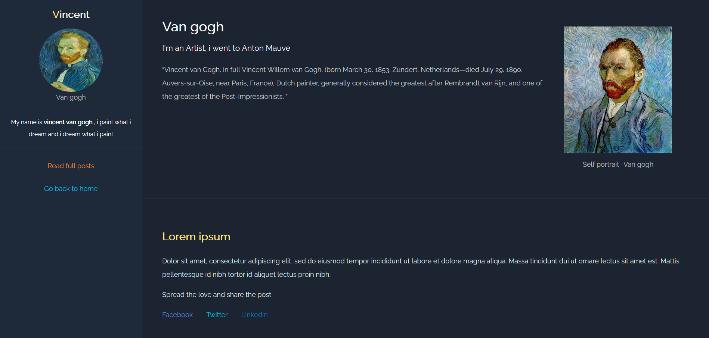

# Personal blog website
 This is the first project in FrontEnd Nanodegree from Udacity
LIVE PREVIEW [HERE](https://marinakhamis.github.io/FEND-01-Personal-Blog-Website/html/index.html)
 ## Skills used in the project:
 - HTML
 - CSS
 - Media queries to make the pages responsive

### This is what the home page looks like
 

 ### This is what the blog page looks like
 

Copyrights: @Marina Khamis 
